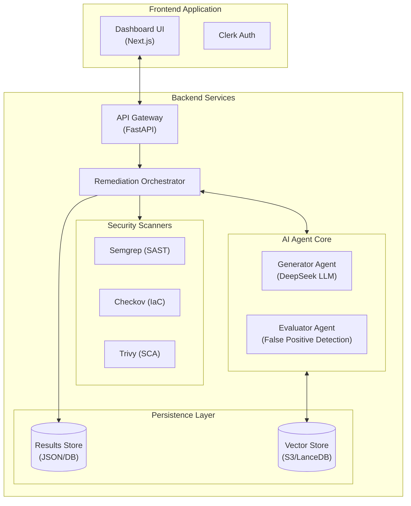

# Security Remediation Intelligence System – Architecture

## 1. Executive Summary
The **Security Remediation Intelligence System** is an agentic AI platform designed to not only identify security vulnerabilities but to automatically fix them. Unlike traditional scanners that generate noise, this system uses a multi-agent AI architecture to analyze findings from industry-standard tools (Semgrep, Checkov, Trivy), generate context-aware code patches, and validate them for safety and correctness before presenting them to the developer.

**Key Capabilities:**
*   **Multi-Scanner Aggregation:** Unified view for SAST (Semgrep), IaC (Checkov), and SCA (Trivy).
*   **Agentic Remediation:** specialized AI agents ("Generator" and "Evaluator") to produce and vet code fixes.
*   **False Positive Detection:** Automated triage to filter out noise with confidence scoring.
*   **Vector-Based Reuse:** RAG architecture to reuse successful remediations for similar future vulnerabilities.
*   **Interactive Dashboard:** A professional Next.js frontend for managing scans and remediations.

---

## 2. High-Level Architecture

The system follows a modern, decoupled architecture designed for scalability and cloud deployment (AWS).



---

## 3. Component Deep Dive

### 3.1 Frontend Layer
*   **Framework:** Next.js (React) with Pages Router.
*   **Styling:** Tailwind CSS with a custom design system (Cards, Badges, Transitions).
*   **Authentication:** Integrated with **Clerk** for secure user management and route protection.
*   **Key Features:**
    *   **Scan Hub:** List of historical scans with status indicators.
    *   **Unified Results:** Filtering findings by scanner type (e.g., "Show only Trivy findings").
    *   **Interactive Remediation:** On-demand AI generation with streaming updates.
    *   **Transparency:** Displays confidence scores and "False Positive" judgments.

### 3.2 Backend Core
*   **Runtime:** Python 3.11+, managed via `uv`.
*   **Framework:** FastAPI for RESTful endpoints.
*   **Asynchronous Processing:** Background worker pattern (asyncio) to handle long-running scans without blocking the API.
*   **Ingestion:**
    *   Automatic cloning of private/public GitHub repositories.
    *   Support for specific commit SHAs.

### 3.3 Security Intelligence (The Agents)
The core innovation lies in the **Agno-based Multi-Agent System**:

#### **Generator Agent (" The Architect")**
*   **Role:** Staff Security Engineer.
*   **Task:** Analyze raw scanner JSON and source code to generate a fix.
*   **Logic:**
    *   Reads surrounding code context to ensure style consistency.
    *   Consults the Vector Store for historically successful fixes (RAG).
    *   Produces a structured JSON response with code changes and developer explanations.

#### **Evaluator Agent ("The Gatekeeper")**
*   **Role:** Lead AppSec Reviewer.
*   **Task:**  Audit the Generator's output.
*   **Logic:**
    *   **False Positive Detection:** Analyzes if the finding itself is valid. If not, flags it and assigns a confidence score.
    *   **Code Review:** Checks for syntax errors, regressions, and security completeness.
    *   **Scoring:** Assigns a 0.0-1.0 confidence score. If < 0.7, the fix is rejected and interacting loops back to the Generator.

### 3.4 Data & Vector Layer
*   **Scan Results:** Stored as structured JSON files (simulating NoSQL documents) keyed by Scan ID.
*   **Vector Store:**
    *   **Implementation:** Abstracted interface supporting Local JSON (dev) and S3 (prod).
    *   **Usage:** Embeddings of vulnerability signatures are stored. When a new bug is found, the system searches for a "nearest neighbor" fix to speed up remediation and ensure consistency across the organization.

---

## 4. Data Models

### Remediation Response
The contract between the AI Agents and the UI:

```python
class RemediationResponse(BaseModel):
    vulnerability_id: str
    severity: Literal["LOW", "MEDIUM", "HIGH", "CRITICAL"]
    summary: str                           # One-line summary
    explanation: str                       # Markdown-formatted deep dive
    code_changes: List[CodeChange]         # Exact file edits
    security_implications: List[str]       # Side effect warnings
    is_false_positive: bool                # AI judgment flag
    confidence_score: float                # 0.0 to 1.0 certainty
```

---

## 5. Security & Deployment

*   **Infrastructure as Code:** Terraform modules for AWS App Runner, S3, and IAM.
*   **Secret Management:** Environment variables (never hardcoded) for GitHub Tokens, DeepSeek Keys, and Cloud Credentials.
*   **Containerization:** Full Docker support for portable deployment.

---

## 6. Future Roadmap
*   **IDE Integration:** VS Code extension to apply these fixes locally.
*   **GitHub Bot:** Auto-open Pull Requests with the generated fixes.
*   **Enterprise Integration:** Jira/ServiceNow webhooks for ticket tracking.
